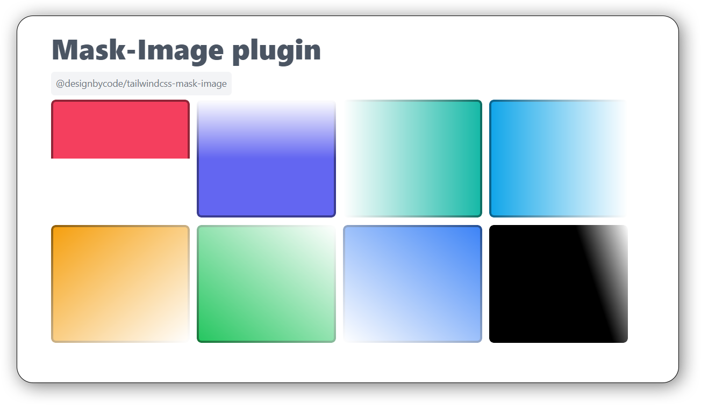

<a href="#installation" width="100%">

</a>

## Tailwind CSS Image Mask Plugin


[](https://github.com/DesignByCode/tailwindcss-mask-image/stargazers)

[](https://nodei.co/npm/@designbycode/tailwindcss-mask-image/)

The Tailwind CSS Image Mask Plugin is a custom plugin that extends Tailwind CSS with utilities for applying image masks using CSS gradients. With this plugin, you can easily create image masks with different directions and gradient styles.



## 📇 Table of Contents

* [Installation](#installation)
    * [Using pnpm](#using-pnpm)
    * [Using npm](#using-npm)
    * [Using yarn](#using-yarn)
* [Usage](#usage)
* [Utilities](#utilities)
* [Applying Image Masks](#applying-image-masks)
* [Default Values](#default-values)
* [Changing Gradient Starting and Ending Points](#changing-gradient-starting-and-ending-points)
    * [Available percentage values for --mask-image-from and --mask-image-to:](#available-percentage-values-for---mask-image-from-and---mask-image-to)
* [Configuration](#configuration)
* [Example](#example)
* [Contributing](#contributing)
* [License](#license)
* [Author](#author)
* [Acknowledgments](#acknowledgments)

## Installation

To use this plugin, you need to install it via pnpm, npm or yarn.

#### Using pnpm

```bash
pnpm install @designbycode/tailwindcss-mask-image
```

#### Using npm

```bash
npm install @designbycode/tailwindcss-mask-image
```

#### Using yarn

```bash
yarn add @designbycode/tailwindcss-mask-image
```

## Usage

Once the plugin is installed, you can enable it in your Tailwind CSS configuration file. Usually, this file is named tailwind.config.js.

```javascript
module.exports = {
    // ...other configurations
    plugins: [
        // ...other plugins
        require("@designbycode/tailwindcss-mask-image"),
    ],
};
```

## Utilities

The plugin generates several utility classes for applying image masks using CSS gradients. You can use these utility classes to easily apply masks to any element in your HTML.

## Applying Image Masks

To make it work you only need to add the class of ```.mask-image-{value}``` to you html. The rest off the classes is just modifiers.

```html

<div class="mask-image-r"></div>
```

You can apply image masks by using the following utility classes:

| Css class name | Description                                   |
|:---------------|:----------------------------------------------|
| .mask-image-t  | Applies a mask from top to bottom.            |
| .mask-image-tr | Applies a mask from top left to bottom right. |
| .mask-image-tl | Applies a mask from top right to bottom left. |
| .mask-image-b  | Applies a mask from bottom to top.            |
| .mask-image-br | Applies a mask from bottom left to top right. |
| .mask-image-bl | Applies a mask from bottom right to top left. |
| .mask-image-r  | Applies a mask from left to right.            |
| .mask-image-l  | Applies a mask from right to left.            |

## Default Values

The plugin sets some default CSS variables in the :root element, which define the default values for the color and direction of the image masks.

| Css Variable      | Description                                    |
|:------------------|:-----------------------------------------------|
| --mask-image-from | Default gradient starting point (default: 0%)  |
| --mask-image-to   | Default gradient ending point (default: 100%). |

## Changing Gradient Starting and Ending Points

You can dynamically change the starting and ending points of the gradient using the following utility classes:

* ```.mask-image-from-0``` to ```.mask-image-from-100```: Changes the --mask-image-from variable to the specified percentage value.

* ```.mask-image-to-0 to``` ```.mask-image-to-100```: Changes the --mask-image-to variable to the specified percentage value.

```html

<div class="mask-image-b mask-image-from-25 mask-image-to-75"></div>
<!-- or by arbitrary value -->
<div class="mask-image-[73%] mask-image-from-[33%] mask-image-to-[66%]"></div>
```

#### Available percentage values for --mask-image-from and --mask-image-to:

| Key | Value  | Output               |
|-----|:------:|:---------------------| 
| 0   |  "0%"  | .mask-image-from-0   |
| 5   |  "5%"  | .mask-image-from-5   |
| 10  | "10%"  | .mask-image-from-10  |
| 15  | "15%"  | .mask-image-from-15  |
| 20  | "20%"  | .mask-image-from-20  |
| 25  | "25%"  | .mask-image-from-25  |
| 30  | "30%"  | .mask-image-from-30  |
| 40  | "40%"  | .mask-image-from-40  |
| 45  | "45%"  | .mask-image-from-45  |
| 50  | "50%"  | .mask-image-from-50  |
| 55  | "55%"  | .mask-image-from-55  |
| 60  | "60%"  | .mask-image-from-60  |
| 70  | "70%"  | .mask-image-from-70  |
| 75  | "75%"  | .mask-image-from-75  |
| 80  | "80%"  | .mask-image-from-80  |
| 85  | "85%"  | .mask-image-from-85  |
| 90  | "90%"  | .mask-image-from-90  |
| 95  | "95%"  | .mask-image-from-95  |
| 100 | "100%" | .mask-image-from-100 |

## Configuration

The plugin allows you to customize the gradient steps and directions by modifying the theme object in your Tailwind CSS configuration file.

```javascript
// tailwind.config.js

module.exports = {
    // ...other configurations
    plugins: [
        // ...other plugins
        require("@designbycode/tailwindcss-mask-image"),
    ],
    theme: {
        imageMaskSteps: {
            // Add your custom gradient steps here
            0: "0%",
            10: "10%",
            25: "25%",
            // ...
        },
        imageMaskDirections: {
            // Add your custom mask directions here
            t: "to top",
            b: "to bottom",
            // ...
        },
    },
};

```

## Example

Here's an example of how you can use the utility classes to apply image masks:

```html

<div class="mask-image-t mask-image-from-30 mask-image-to-70">
    <!-- Your content here -->
</div>

```

## Contributing

Contributions to this plugin are welcome! If you encounter any issues, have feature requests, or want to improve the plugin, feel free to create a pull request or submit an issue on the GitHub repository.

## License

This project is licensed under the [MIT](LICENCE) License - see the [LICENSE](LICENCE) file for details.

## Author

<div>

</div>
<h2 style="margin-top:0">Claude Myburgh</h2><ul style="padding-left:0;margin-top:-.63rem;list-style:none"><li>Github:<a href="https://github.com/designbycode"> @designbycode</a></li><li>Npm:<a href="https://www.npmjs.
com/~designbycode_"> @designbycode_</a></li></ul>

## Acknowledgments

- This plugin is inspired by the needs of web developers using Tailwind CSS.
- Special thanks to the Tailwind CSS team for creating such an amazing framework.


